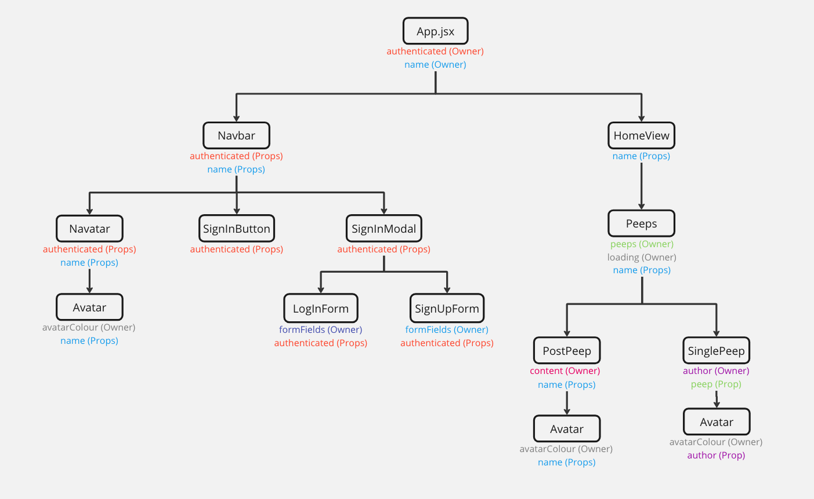
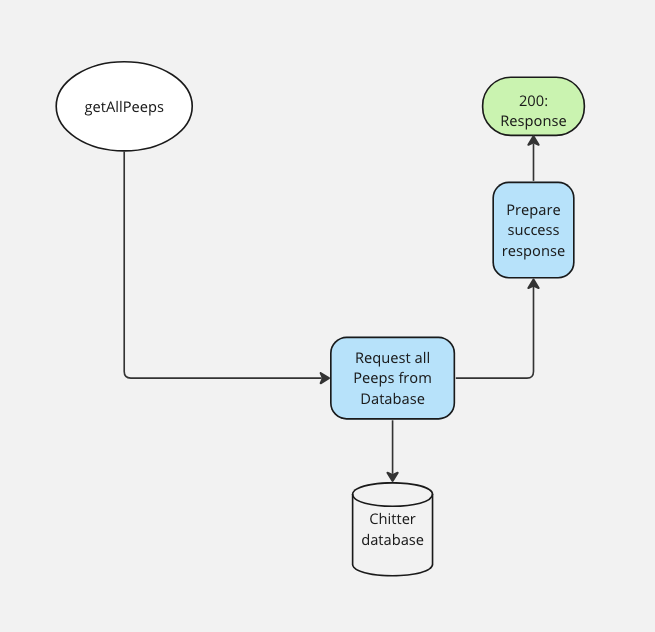
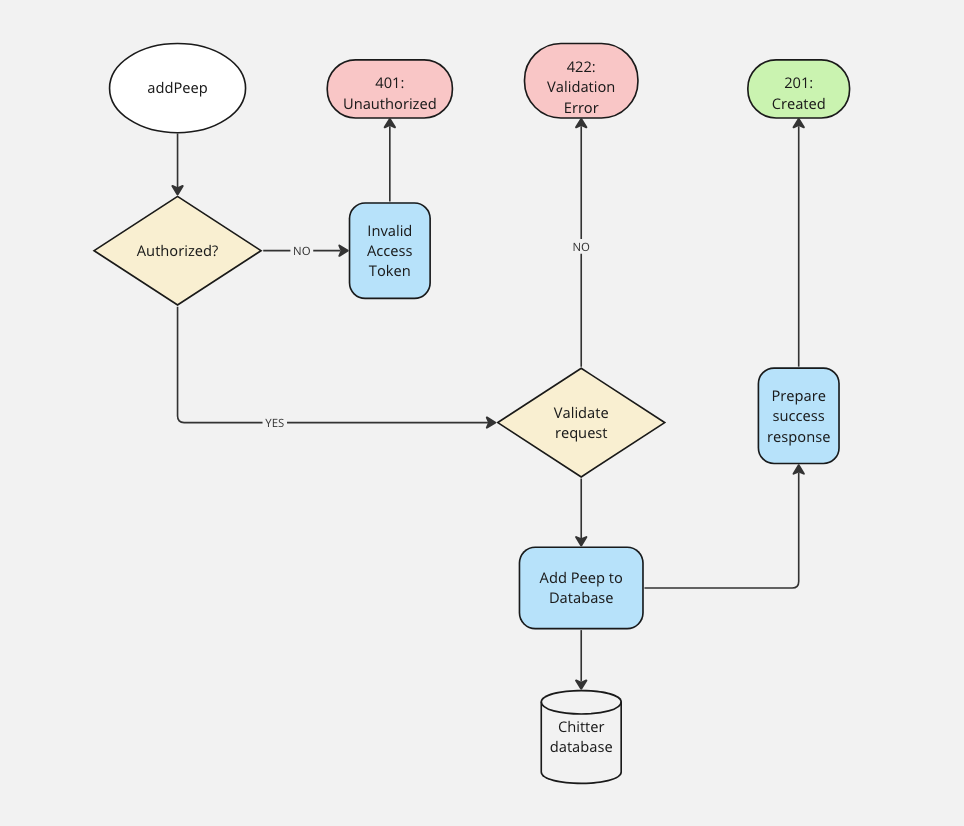
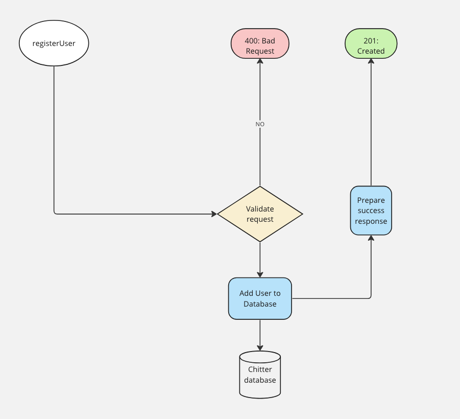
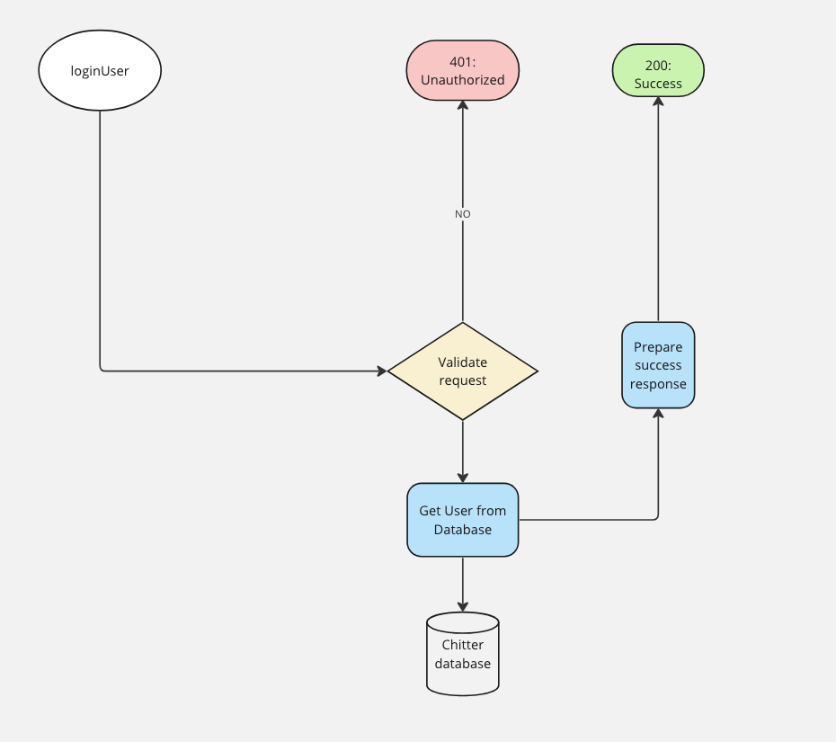

# User Stories, Test Plan, Component Hierachy & Routing Diagrams:

## Backend:

1. **As a user, I want to be able to create an account using my email, password, name and a username, so that I can use Chitter's functionalities**

- TEST: registerUser controller should call registerUserService
- TEST: registerUser controller should call res.json and res.status with the result of registerUserService call
- TEST: POST requests to /api/user/register should add a properly formatted user to the database
- TEST: POST requests to /api/user/register should not allow registration when passwords do not match

2. **As the system, I want the username and email to be unique, so that I can distinguish one user from another**

- TEST: POST requests to /api/user/register should not allow registration when email is duplicated
- TEST: POST requests to /api/user/register should not allow registration when username is duplicated

3. **As a user, I want to be able to log in with my email/username and password, so that I can start posting**

- TEST: loginUser controller should call loginUserService
- TEST: loginUser controller should call res.json and res.status with the result of loginUserService call
- TEST: POST requests to /api/user/login should return a token when a user logs in with username
- TEST: POST requests to /api/user/login should return a token when a user logs in with email
- TEST: POST requests to /api/user/login should return an error message when a user logs in with incorrect usernameOrEmail
- TEST: POST requests to /api/user/login should return an error message when a user logs in with incorrect password

4. **As a user, I want to be able to create and post a Peep if I am logged in, so that I can keep others updated**

- TEST: addPeep controller should call addPeepService
- TEST: addPeep controller Should call res.json and res.status with the result of addPeepService call
- TEST: POST requests to /api/peep should add a properly formatted peep to the database
- TEST: POST requests to /api/peep should not allow a peep to be added with empty content field

5. **As a user, I want each Peep to have an author, so that I can see who posted it**

- TEST: getSingleUser controller should call getSingleUserService
- TEST: getSingleUser controller should call res.json and res.status with the result of getSingleUserService call
- TEST: GET requests to /api/user/:id should return a user when a valid id is provided
- TEST: GET requests to /api/user/:id should return status 404 when an invalid id is provided

6. **As a user, I want to be able to get all Peeps, so that I can see everyone's Peeps.**

- TEST: getAllPeeps controller should call getAllPeepsService
- TEST: getAllPeeps controller should call res.json and res.status with the result of getAllPeepsService call

7. **As a system, I want to receive a JWT upon successful log in and/or sign up, so that secure authentication can be provided for subsequent requests**

- TEST: POST requests to /api/peep should not allow a peep to be added without a valid token

## Frontend:

1. **As a user, I want to be able to see all peeps, regardless of whether I am logged in or not, so I can keep updated on what's happening**

- TEST: getAllPeeps should return all peeps
- TEST: getUser should return a user
- TEST: Peeps should be displayed when not logged in
- TEST: Peeps should be displayed when logged in

2. **As a user, I want to see peeps displayed in reverse chronological order, so I can see the la- test Peeps first**

- TEST: Peeps should be displayed in reverse chronological order

3. **As a user, I want to be able to sign up to Chitter, so that I can post from my account**

- TEST: signUp should return a user and a token
- TEST: User should be able to submit a sign up form and be logged in automatically
- TEST: Should return an error if username is duplicated
- TEST: Should return an error if passwords do not match

4. **As a user, I want to be able log in to Chitter, so I can post a Peep**

- TEST: logIn should return a user and a token
- TEST: Not logged in user should see button to log in
- TEST: Logged in user should see their Avatar with log out button
- TEST: Should log in a user

5. **As a user, I want to be able to log out of Chitter, so that others can't access my account**

- TEST: Should see Log In button after logging out

6. **As a user, I want to be able to post a Peep when logged in, so that my posts have my name on it**

- TEST: postPeep should post a Peep
- TEST: Should see prompt to log in to post when not logged in
- TEST: Should see input box for posting Peep when logged in
- TEST: Should be able to post a Peep when logged in
- TEST: Should not be able to post a Peep if content is whitespace

7. **As a user, I want to be able to see a Peep's user and handle, so I know who posted it**

- TEST: Peep should display author's name and handle

8. **As a user, I want to UI to be responsive across all devices, so that I can easily use it on any device**

## Component Hierachy, State/Data Flow Diagram



## Models & API Routing Diagrams

- User Model:

```javascript
{
  firstname: { type: String, required: true },
  lastname: { type: String, required: true },
  username: { type: String, required: true, unique: true },
  email: { type: String, required: true, unique: true },
  password: { type: String, required: true },
  createdAt: { type: Date, required: true}
}
```

- Peep Model:

```javascript
{
	content: { type: String, required: true, maxlength: 420 },
	author: { type: String, required: true },
	createdAt: { type: Date, required: true}
}
```





